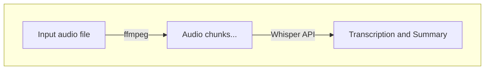

# audio-to-text

## Pre-requisites
- poetry
- Whisper API key
- ffmpeg

## Usage

This script does the following:
1. Split input audio file into chunks to avoid API limits
2. Transcribe audio chunks to text using Whisper API and output to a text file



To run the script, execute the following command:
```
poetry install
poetry run python main.py <audio_file> <output_file>
# e.g. poetry run python main.py audio.mp3 output.txt
```
