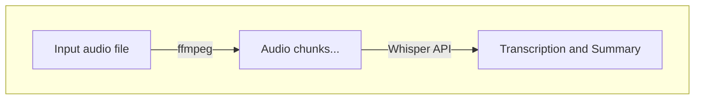

# meeting-summarizer

## Pre-requisites
- poetry
- OpenAI API key
- ffmpeg

## Usage

This script does the following:
1. Split input audio file into chunks to avoid API limits
2. Transcribe audio chunks to text using Whisper API and output to a text file



To run the script, execute the following command:
```
export OPENAI_API_KEY=<your_openai_api_key>
poetry install
poetry run python main.py <audio_file>
# e.g. poetry run python main.py audio.mp3
```

Then, chunks are outputed to `<audio>_chunks` folder and transcriptions are outputed to `<audio>_transcriptions.txt`

## How to record the meeting

I use [Blackhole](https://existential.audio/blackhole/) to create a virtual audio device that can be used as an output for recording. And I use QuickTime Player to record the audio.

Ref: [BlackHoleでMac上で再生される音声を録音する](https://dev.classmethod.jp/articles/record-sounds-on-mac-with-blackhohle/)
